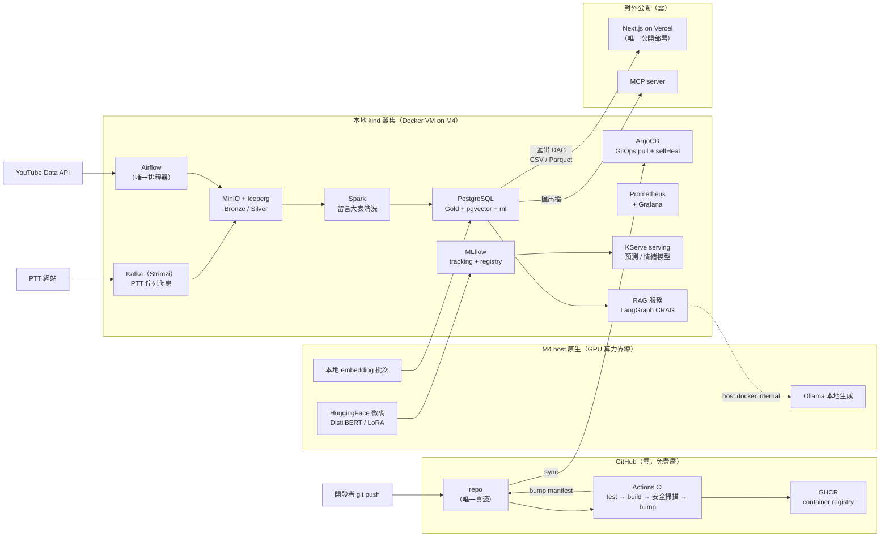

# P5 收尾（CI 安全掃描 + 架構圖 + 面試敘事）— Design（Fable 5 產出）

> **狀態**：design 完成，待 Opus 寫 implementation plan（P5 在 P0–P4 全實作後才執行）。
> **上游**：[`2026-07-08-P5-polish-hardening-brief.md`](2026-07-08-P5-polish-hardening-brief.md) + [`../architecture/NORTH_STAR.md`](../architecture/NORTH_STAR.md) + P0 design（CI 結構正本）+ P1/P1-留言/P2/P3 design + P4 brief。已鎖定決策（GitHub Actions per-service workflow、免費/OSS 優先、portfolio 誠實敘事、一個平台打三 JD）全部沿用，未翻案。
> **版本查證日**：2026-07-08（GitHub releases/tags API + 官方 README 當日查證，非記憶）。
> **本檔自身的硬界線**：spec 只定「做什麼/用什麼/掛哪裡」。**本檔不含任何掃描結果、漏洞數、截圖**——那些是執行 plan 對真 artifact 產生的（§1 有完整界線表）。

---

## 0. 版本 pin 表（已查證）

| 元件 | 版本 | 查證方式 |
|---|---|---|
| `aquasecurity/trivy-action` | **v0.36.0**（tag 存在已驗；2026-04-22 發布） | GitHub releases/tags API |
| Trivy 引擎 | action 內建版本，**不另 pin**（Trivy 本體 latest = v0.72.0，2026-07-08 查） | GitHub releases API；plan 前實查點見 §7 |
| `github/codeql-action`（init / analyze / upload-sarif） | **@v4**（major 浮動釘法，latest v4.36.3） | GitHub tags API |
| `gitleaks/gitleaks-action` | **@v3**（latest v3.0.0，2026-05-30；Node 24 runtime，個人帳號**免 license**） | GitHub releases API + 官方 README（`GITLEAKS_LICENSE` only for organizations） |
| gitleaks 引擎 | action 內建（gitleaks 本體 latest v8.30.1） | GitHub releases API |
| `actions/checkout` | **@v7**（沿 P0 §0 既釘，不另查） | P0 design |
| Mermaid | GitHub 原生渲染（版本由 GitHub 控制，**無需 pin、無需建置工具鏈**） | 選型理由見 §3 |

費用確認：GitHub Actions / code scanning（CodeQL + SARIF upload）/ secret scanning + push protection / Dependabot alerts 對 **public repo 全免費**；Trivy、gitleaks 皆 OSS。P0 已定 repo = public，P5 零付費 SaaS（硬約束達成）。**不用 SonarQube**（NORTH_STAR 提及的候選之一，但它是常駐服務 + CodeQL 已覆蓋 SAST 職能——一個工作一個工具）。

---

## 1. 總體形狀 +「現在可定 vs 執行期」界線（硬約束正面處理）

P5 = 四簇：①CI 安全掃描（§2）②架構圖（§3）③面試敘事（§4）④README 最終打磨（§5）。全部掛在既有產物上，**零新常駐服務、零新 k8s 元件、零新資料表**——收尾不長成第二平台。

### 界線表（本 design 的誠實正本；plan 照此分 task）

| | 現在可定（本 design 已拍板） | 執行 plan 才對真 artifact 做 |
|---|---|---|
| 安全掃描 | 工具集＋版本、workflow 檔清單與 YAML 形狀、gate 分級政策、SARIF/報告去向、誤報抑制**機制**（`.trivyignore`/`.gitleaksignore` 的格式與紀律） | 對真 image/真 repo 跑首輪掃描、**triage 真實 findings**（兩個 ignore 檔**起始為空**，每筆豁免都是執行期 triage 的產物、必附理由註解）、repo Settings 一次性開關、壞樣本演練 |
| 架構圖 | 工具、張數、每張的範圍/分區/節點/邊清單、放置路徑、渲染鐵律；總覽圖完整 Mermaid 碼（圖的內容＝已定案架構，不依賴實跑） | push 後在 GitHub 上目測渲染、依實作若有偏差微調節點名 |
| 面試敘事 | 文件清單、每份結構、決策索引（收攏自各 design 的取捨章節，含出處錨點） | 敘事中「可現場 demo」清單對真環境走一遍確認可演；（可選 additive）補「實測」段——實跑後的真數據才寫，**初版不含任何量化成果** |
| README | 區塊清單與定序、badge 清單、截圖/GIF **清單**與存放路徑 | 拍真截圖/GIF、嵌入、badge 指向真 repo |

**禁止事項（寫給 plan 執行者）**：不得在任何文件放「預期掃描結果」「示意漏洞數」「佔位截圖」；沒拍到的圖區塊整段留待，不放 broken link。

---

## 2. P5-1 CI 安全掃描（決定）

### 2.1 開放問題收斂

| 問題 | 決定 | 理由 / 淘汰方案 |
|---|---|---|
| 選哪幾個工具 | **Trivy（image 弱點 + config 誤設定，一工具兩模式）＋ gitleaks（secret，git 全史）＋ CodeQL（SAST，`python` + `javascript-typescript` 兩語言）**；另在 repo Settings 開 GitHub 原生 **secret scanning + push protection** 與 **Dependabot alerts**（一次性設定，深度防禦，非 CI gate） | 覆蓋四類：依賴/OS 弱點、IaC 誤設定、secret、程式碼缺陷。淘汰：Semgrep（與 CodeQL 職能重疊）、kube-linter（Trivy config 已掃 k8s manifest，不為同一工作加第二工具）、SonarQube（常駐服務）、npm audit CI step（frontend 依賴弱點由 Dependabot alerts + CodeQL JS 覆蓋，audit 噪音高） |
| 掛在哪 | **四個掛載點**（§2.2 總表）：①每服務 CI 的 **push 之後、bump 之前**掃 image ②repo 級 workflow 掃 secret/SAST/manifest（push main + PR）③**weekly 排程**全量重掃 ④PR 上 pr-checks 原樣不動（服務級 lint/test），repo 級掃描各自帶 `pull_request` 觸發 | image gate 卡在 **GitOps 交棒點**：image 可進 GHCR（tag 可回溯、build cache 不浪費、不用把 build-push-action 拆兩段），但 **CRITICAL 沒清就不 bump manifest = 不進叢集**。這比「擋 registry」更準確地保護了真正的邊界（部署由 manifest 決定）。weekly 重掃是因為 CVE 時變——build 時乾淨 ≠ 永遠乾淨 |
| gate 政策 | **分級**（§2.3 總表）：secret = **零容忍**（任一 finding 即 fail）；image/manifest = **CRITICAL（有修復版）擋、HIGH 只報告**；CodeQL = PR check 對新增 high+ alert 亮紅、push 走 Security tab 報告；weekly = 紅燈當巡檢警報（無 merge 可擋） | 照 brief 傾向落地並補分級論證：secret 一旦進 git 史就是永久事故，嚴格度應最高；CVE 有誤報與不可修（unfixed）常態，全擋會把 gate 訓練成「大家習慣紅燈」——分級才是務實 gate 的面試敘事點 |
| 掃描結果去哪 | **GitHub Security tab（code scanning）為主匯流**：Trivy 兩模式 SARIF 經 `codeql-action/upload-sarif@v4` 上傳（帶 category 區分）、CodeQL 原生；gitleaks 走 action 原生 job summary + SARIF artifact（不上 Security tab，action 不支援且 summary 已夠用） | public repo 的 code scanning 免費；單一入口看全部 findings 是 DevOps 成熟度訊號 |
| 誤報抑制 | repo 根 **`.trivyignore`**（CVE/misconfig ID，支援 `exp:` 到期日）＋ **`.gitleaksignore`**（fingerprint）。紀律：**每筆豁免必附註解（理由 + 出處）**，能加 `exp:` 到期日就加；兩檔**起始為空**，內容只能來自執行期 triage | 機制現在定、內容執行期產——不放假 findings |
| 掃不掃 `frontend/` | **掃**：CodeQL 語言矩陣含 `javascript-typescript`（P5 執行時 P4 已完成，frontend 存在）；依賴層走 Dependabot alerts；frontend 無自建 image（Vercel 託管 build）故無 image 掃描 | 對齊 P4 拓撲：frontend 不進 GHCR/k8s |

### 2.2 Workflow 檔總表（掛載形狀正本）

新增 4 支 + 1 支 reusable，並改造既有每服務 CI（以 hello 為範本）：

| 檔案 | 觸發 | 內容 | gate |
|---|---|---|---|
| `.github/workflows/reusable-image-scan.yaml` | `workflow_call`（inputs: `image-ref`, `category`） | Trivy image 兩段：①table 格式、`severity: CRITICAL`、`ignore-unfixed: true`、`exit-code: 1`（gate）②SARIF、`severity: HIGH,CRITICAL`、`if: always()` 上傳 Security tab | 第①段 |
| `<svc>-ci.yaml`（既有，每服務） | 原 paths 過濾不變 | job 鏈改為 `test → build-push → scan（呼叫 reusable） → bump`（§2.4） | scan fail → 不 bump → 不部署 |
| `.github/workflows/gitleaks.yaml` | `push`(main) + `pull_request` + weekly cron + `workflow_dispatch`；**無 paths 過濾**（secret 可能在任何檔） | checkout `fetch-depth: 0`（全史）→ `gitleaks/gitleaks-action@v3` | 任一 finding 即 fail（零容忍） |
| `.github/workflows/codeql.yaml` | `push`(main) + `pull_request` + weekly cron | init/analyze @v4，matrix：`python` / `javascript-typescript`，`build-mode: none` | PR check 對新增 high+ alert fail（repo Settings 的 check failure threshold 設 **High or higher**，§7 一次性設定）；push = 報告 |
| `.github/workflows/manifest-scan.yaml` | `push`(main) + `pull_request`，paths：`"**/k8s/**"`, `"platform/argocd/**"`, `"platform/bootstrap/**"`, `"**/Dockerfile"` | Trivy `scan-type: config` 掃全 repo IaC（k8s manifest + Dockerfile）；兩段同 reusable 姿態（gate CRITICAL / SARIF HIGH,CRITICAL，category `trivy-config`） | CRITICAL 擋 |
| `.github/workflows/security-scan.yaml` | weekly cron + `workflow_dispatch` | ①matrix over **已部署服務 image 清單**（`:latest`）呼叫 reusable ②Trivy config 全 repo 一輪 | 紅燈 = 巡檢警報（「已部署 image 出現新 CRITICAL」的訊號），非 merge gate |

**服務接入契約擴充**（接 P0 §1 的「未來服務接入契約」，寫進 README）：新服務上線 = kustomize `k8s/` + ArgoCD 子 Application + **CI 照範本含 scan job + 把 image 名加進 `security-scan.yaml` 的 matrix**。四項缺一不收。

cron 錯開：gitleaks `0 2 * * 1`、codeql `30 2 * * 1`、security-scan `0 3 * * 1`（週一台北早上前後，避免同時搶 runner）。

### 2.3 Gate 分級政策總表（面試敘事素材，§4 引用）

| 資產 | 工具 | 擋什麼 | 只報告什麼 | 為何這樣分 |
|---|---|---|---|---|
| git 內容 | gitleaks | **任何 secret finding** | — | secret 進 git 史 = 永久外洩，零容忍；誤報走 `.gitleaksignore` fingerprint 逐筆豁免 |
| container image | Trivy image | **CRITICAL 且有修復版**（`ignore-unfixed: true`） | HIGH（SARIF → Security tab） | 無修復版的 CVE 擋了也無解，只會逼人繞過 gate；HIGH 保持可見但不擋節奏 |
| k8s manifest / Dockerfile | Trivy config | CRITICAL 誤設定 | HIGH | 本地 demo 叢集有刻意為之的設定（如 kind hostPort），預期需 triage 豁免——豁免必附理由，這本身就是務實 gate 的展示 |
| 原始碼 | CodeQL | PR 新增 high+ alert | 其餘（Security tab） | SAST 誤報率最高，只對「新增」亮紅避免存量綁架 |
| 已部署 image（weekly） | Trivy image | —（無 merge 可擋） | 全部；workflow 紅燈當警報 | 時變 CVE 的持續巡檢 |

### 2.4 每服務 CI 改造形狀（以 `hello-ci.yaml` 為範本，其他服務照抄）

P0 的 `build-push-bump` 單 job 拆三 job（reusable workflow 只能 job 級呼叫）；`test` job 原樣：

```yaml
jobs:
  test: { }            # 原樣不動
  build-push:          # 原 build-push-bump 去掉 bump step
    needs: test
    runs-on: ubuntu-latest
    permissions: {packages: write, contents: read}
    outputs:
      tag: ${{ steps.tag.outputs.TAG }}
    steps:
      # checkout / tag / buildx / login / build-push 五步全同 P0 §4，不重抄
  scan:
    needs: build-push
    uses: ./.github/workflows/reusable-image-scan.yaml
    with:
      # ⚠️ gotcha：reusable 呼叫的 with 裡不能用 env context → 寫全字面
      image-ref: ghcr.io/${{ github.repository }}/hello:${{ needs.build-push.outputs.tag }}
      category: trivy-image-hello
  bump:                # GitOps 交棒點，scan 綠才走到這
    needs: [build-push, scan]
    runs-on: ubuntu-latest
    permissions: {contents: write}
    steps:
      - uses: actions/checkout@v7
      - name: Bump manifest tag
        run: |
          yq -i '.images[0].newTag = "${{ needs.build-push.outputs.tag }}"' platform/hello/k8s/kustomization.yaml
          # git config / add / commit [skip ci] / pull --rebase / push 同 P0 §4
```

`reusable-image-scan.yaml` 完整形狀：

```yaml
name: reusable-image-scan
on:
  workflow_call:
    inputs:
      image-ref: {required: true, type: string}
      category:  {required: true, type: string}
jobs:
  scan:
    runs-on: ubuntu-latest
    permissions: {security-events: write, contents: read}
    steps:
      - uses: actions/checkout@v7          # 為了讀 repo 根 .trivyignore
      - name: Gate — CRITICAL（有修復版才擋）
        uses: aquasecurity/trivy-action@v0.36.0
        with:
          image-ref: ${{ inputs.image-ref }}
          format: table
          severity: CRITICAL
          ignore-unfixed: true
          exit-code: "1"
          trivyignores: .trivyignore
      - name: Report — HIGH,CRITICAL → SARIF
        if: always()
        uses: aquasecurity/trivy-action@v0.36.0
        with:
          image-ref: ${{ inputs.image-ref }}
          format: sarif
          output: trivy.sarif
          severity: HIGH,CRITICAL
          ignore-unfixed: true
          trivyignores: .trivyignore
      - uses: github/codeql-action/upload-sarif@v4
        if: always()
        with:
          sarif_file: trivy.sarif
          category: ${{ inputs.category }}
```

`codeql.yaml` 完整形狀：

```yaml
name: codeql
on:
  push: {branches: [main]}
  pull_request: {branches: [main]}
  schedule: [{cron: "30 2 * * 1"}]
jobs:
  analyze:
    runs-on: ubuntu-latest
    permissions: {security-events: write, contents: read, actions: read}
    strategy:
      fail-fast: false
      matrix:
        language: [python, javascript-typescript]
    steps:
      - uses: actions/checkout@v7
      - uses: github/codeql-action/init@v4
        with:
          languages: ${{ matrix.language }}
          build-mode: none
      - uses: github/codeql-action/analyze@v4
        with:
          category: "/language:${{ matrix.language }}"
```

`gitleaks.yaml` 完整形狀（個人帳號免 `GITLEAKS_LICENSE`，不設該 env）：

```yaml
name: gitleaks
on:
  push: {branches: [main]}
  pull_request:
  schedule: [{cron: "0 2 * * 1"}]
  workflow_dispatch:
jobs:
  scan:
    runs-on: ubuntu-latest
    steps:
      - uses: actions/checkout@v7
        with: {fetch-depth: 0}          # 全史掃描
      - uses: gitleaks/gitleaks-action@v3
        env:
          GITHUB_TOKEN: ${{ secrets.GITHUB_TOKEN }}
```

`manifest-scan.yaml` 與 `security-scan.yaml` 依 §2.2 總表組裝（trivy config 兩段姿態同 reusable；weekly 的 image matrix 起始 = `[hello]`，P5 執行時以 `platform/argocd/apps/` 實際清點補齊，§7）。

### 2.5 已知壞樣本驗收（brief「會擋一個已知壞樣本」的落地；全部執行期做）

| # | 演練 | 做法 | 預期 |
|---|---|---|---|
| 1 | gitleaks 擋 secret | 臨時分支 commit 一個 gitleaks 官方文件用的假 AWS key（`AKIA...` 範例值）→ 開 PR → 看 gitleaks job fail → 關 PR 刪分支（假 canary key，dangling commit 無害） | PR check 紅 |
| 2 | Trivy image 擋 CRITICAL | `workflow_dispatch` 跑 `security-scan.yaml` 前，臨時把 matrix 加一個已知帶 CRITICAL 的舊 base image（如 `debian:10`）→ 跑完移除 | 該 matrix job 非零退出 |
| 3 | Trivy config 擋誤設定 | 臨時分支在任一 deployment 加 `privileged: true` → PR → manifest-scan fail → 關 PR | PR check 紅 |
| 4 | CodeQL 有效性 | 不注入假漏洞碼（污染 git 史不值）；驗收 = 兩語言 analysis 成功 + Security tab 出現 code scanning 結果頁 | Security tab 有兩個 language category |

---

## 3. P5-2 架構圖（決定）

### 3.1 開放問題收斂

| 問題 | 決定 | 理由 / 淘汰方案 |
|---|---|---|
| 工具 | **Mermaid（唯一）** | GitHub README/docs 原生渲染、純文字可版控、零建置工具鏈。淘汰：D2（需要 build step 產 SVG，README 不原生渲染，為四張圖引入工具鏈不值）、Excalidraw（二進位 scene 檔 diff 不友善）。四張圖複雜度皆在 Mermaid flowchart 能力內，不留「複雜再換 D2」的尾巴 |
| 張數 / 範圍 | **4 張**（§3.2 清單）：①平台總覽（含部署拓撲界線）②資料流（medallion 端到端）③ML 生命週期（三條垂直 + M4/k8s 算力界線）④CI/GitOps/安全掃描迴圈 | 一張塞全部會爆（gantt 之外 flowchart 同樣有「太大靜默劣化」問題）；按「三 JD 各有一張主圖 + 一張門面總覽」切，敘事文件（§4）各自引用對應圖。部署拓撲不另開第五張——總覽圖的 subgraph 分區就是拓撲界線（M4 host / kind / 雲） |
| 放哪 | 總覽圖**只住 README**（單一正本，不重複貼）；其餘三張各一檔住 `docs/architecture/diagrams/{data-flow,ml-lifecycle,cicd-security}.md`（mermaid code block + 一段文字導讀），README 連結 | 避免同圖兩份漂移 |
| 渲染驗收 | push 後 GitHub 上**目測渲染成功**即可（開發時可用 mermaid.live 預檢）；不裝 mermaid-cli | 右尺寸：四張靜態圖不值得為 CI 渲染驗證加 node 工具鏈 |

### 3.2 圖清單與內容規格

**渲染鐵律（四張圖一體適用，寫給 plan 執行者）**：①含中文標點/括號/冒號的標籤**一律雙引號包裹**；②節點 ID 全英文、不用保留字（`end`/`graph`/`class`/`direction`…）；③標籤換行用 `<br/>` 不用 `\n`；④**不依賴 subgraph 內 `direction`**（GitHub 渲染常忽略）——需要不同方向就拆圖；⑤邊標籤不含裸 `AND`/`OR`；⑥不對 subgraph 本身拉邊，邊只連節點。

**圖① 平台總覽**（README 嵌入；完整碼如下，plan 直接取用後目測校準）：



（節點名以 P0–P3 design 的資源名為準；P4 design 產出後若 MCP 落點不同，只改 `PUB` 分區兩節點——additive 校準，不動整圖。）

**圖② 資料流**（`docs/architecture/diagrams/data-flow.md`；內容清單，plan 依此組圖）：
- 方向 LR；分區：來源（YouTube API 影片/留言、PTT）→ Bronze（MinIO 原始 JSON 信封，決定性 key）→ Silver（Iceberg：`video_snapshots`、`silver_youtube_comments`、PTT 貼文表；標注「Spark 只清留言大表、PTT parse 用 Python」）→ dbt（節點標 DQ 測試閘）→ Gold（Postgres：5 表 + `gold_video_sentiment` + `gold_ptt_board_daily`）→ 匯出 DAG → 前端/MCP。
- 邊標注寫入語意關鍵字：留言 `MERGE INTO`、快照 append、PTT at-least-once。

**圖③ ML 生命週期**（`ml-lifecycle.md`）：
- 三個並排分區（tabular / RAG / 微調）+ 底部共用分區（MLflow、Prometheus）。
- tabular：Gold 特徵 → DVC 快照 → 訓練 → MLflow registry（Staging→Prod）→ KServe → **drift 監控（PSI/KS/AUC）→ Airflow 重訓迴圈**（畫成回邊，這是全圖唯一迴圈）。
- RAG：留言 → 本地 embedding（標 M4 host）→ pgvector → LangGraph CRAG（檢索自評/改寫重檢）→ Ollama（M4）/Gemini 切換 → 評估閘。
- 微調：留言/標題 → LLM 弱標註 → DistilBERT 蒸餾（→ KServe CPU）｜LoRA 標題生成（→ GGUF → Ollama）；兩條標「訓練跑 M4、產出上 MLflow/MinIO 可攜雲端」。
- M4/k8s 界線用**節點放進不同分區**表達（不依賴 subgraph direction）。

**圖④ CI/GitOps/安全掃描迴圈**（`cicd-security.md`）：
- 方向 LR：push/PR → 四道 repo 級掃描（gitleaks/CodeQL/manifest-scan/pr-checks）→ main → 每服務 CI（test → build → push GHCR → **Trivy gate** → bump manifest）→ ArgoCD sync → 叢集；旁支：weekly security-scan 回掃 GHCR `:latest`；SARIF 匯流 Security tab。
- gate 節點用醒目標籤標「CRITICAL 擋 / HIGH 報告 / secret 零容忍」（§2.3 的視覺版）。

---

## 4. P5-3 面試敘事（決定）

### 4.1 開放問題收斂

| 問題 | 決定 | 理由 / 淘汰方案 |
|---|---|---|
| 形式 | **每 JD 一份 one-pager**（`docs/interview/DE.md` / `MLOPS.md` / `DEVOPS.md`）＋ 一份**共用決策索引** `docs/interview/DECISIONS.md`（ADR-lite 表格：決策｜情境｜候選方案｜為何這樣選｜出處錨點） | one-pager 是面試前 10 分鐘能重讀完的形狀；決策索引避免三份 JD 檔重複展開同一取捨（JD 檔引用索引條目）。淘汰：正式 ADR 目錄（每決策一檔，儀式感超過單人 portfolio 需要）、純 STAR 題庫（決策已散在各 design，收攏成索引比重寫題庫忠實） |
| 落點 | `docs/interview/`，README 尾段連結 | 與 specs/plans 平行，意圖清楚 |
| 對齊各 design 已寫的取捨 | **敘事是收攏不是重寫**：DECISIONS.md 每條目必附出處（design 檔名+章節錨點），內文只允許「濃縮 + 口語化」，不允許新增 design 裡沒有的論證或數字 | 防漂移；面試被追問時能翻回原始論證 |
| JD 關鍵字對照表 | 併入各 JD one-pager 尾段一個小表（「JD 常見關鍵字 ↔ 本專案證據（連結）」），**不獨立成檔** | YAGNI |
| 誠實紅線 | 三份檔皆設固定「誠實邊界」節；**初版不含任何量化成果**；實跑後的真數據（如留言實際列數、驗收輸出）可 additive 補進「實測」小節——沒跑就沒有該節 | 對齊 NORTH_STAR 誠實敘事與 brief 硬約束 |

### 4.2 one-pager 統一結構（三份共用骨架）

1. **30 秒定位**：一句話（本 JD 視角的平台是什麼）+ 對應架構圖連結（DE→圖②、MLOps→圖③、DevOps→圖①④）。
2. **本 JD 的架構切面**：3–5 行，只講該層的輸入/輸出邊界。
3. **深講決策 ×5**（引用 DECISIONS.md 條目；每條：情境→候選→取捨→這樣選了之後可示範什麼行為）。
4. **可現場 demo 清單**：可實跑的命令/畫面（`make verify`、ArgoCD UI sync、Grafana dashboard、`curl` KServe、Airflow DAG graph、前端網址…）——執行期逐條走過一遍確認可演。
5. **誠實邊界**：本層刻意沒做什麼、為什麼（見 4.3 各檔分配）。
6. **JD 關鍵字對照小表**。

### 4.3 決策索引初始條目清單（收攏來源已核對；plan 照抄成表）

| # | 決策 | 主要出處 | 進哪些 JD 檔 |
|---|---|---|---|
| 1 | 一個平台三層疊、一個工作一個工具（反面教材 finmind 32 容器） | NORTH_STAR 核心原則 | 三份全 |
| 2 | 主幹 YouTube 而非 PTT/金融（同時餵數字與文字兩條 ML 線） | NORTH_STAR | DE、MLOPS |
| 3 | 留言 ingest 一份資料打三目的（正當化 Spark/Iceberg 的真實大表） | P1-留言 design §1、§10 | DE |
| 4 | Kafka only、不 RabbitMQ+Celery（一種 messaging 範式；at-least-once 手動 commit） | P3 design §1（該章本就標明「＝面試敘事」） | DE、DEVOPS |
| 5 | PTT Silver parse 用 Python 不硬上 Spark（右尺寸） | P3 design §6 | DE |
| 6 | pgvector 不 Qdrant（複用既有 Postgres，不加常駐服務） | P2 design §1、NORTH_STAR | MLOPS |
| 7 | LangGraph CRAG 取代 CrewAI（檢索自評/改寫重檢，可測的工程層） | P2 design §9 | MLOPS |
| 8 | 微調原生跑 M4、kind 摸不到 Apple GPU；HF 標準格式可攜雲端 GPU | NORTH_STAR M4 原則、P2 design §1④ | MLOPS、DEVOPS |
| 9 | KServe RawDeployment、不裝 Knative/Istio（右尺寸 serving） | P2 design §1① | MLOPS、DEVOPS |
| 10 | 蒸餾 pattern：LLM 弱標註 → DistilBERT → CPU serving（貴模型變便宜模型） | P2 design §11 | MLOPS |
| 11 | 平台不部署、前端 Vercel、匯出檔為合約邊界（JAMstack） | NORTH_STAR P4 段 | DEVOPS、DE |
| 12 | GitOps 全套：app-of-apps、prune+selfHeal、sha tag、kustomize+yq 不 sed、GITHUB_TOKEN 不 PAT | P0 design §3–4 | DEVOPS |
| 13 | P0 零 secret 姿態 + secret 邊界策略（k8s Secret 命令式起步） | P0 design §7 | DEVOPS |
| 14 | 去識別在 Bronze 落地前的 ingest 邊界（作者欄位遮蔽） | P1-留言 design §1② | DE |
| 15 | 安全 gate 分級：secret 零容忍／CRITICAL 擋 GitOps 交棒點／HIGH 報告／weekly 巡檢 | 本 design §2.3 | DEVOPS |
| 16 | 監控 emptyDir 不假持久；Airflow KubernetesExecutor；Iceberg JDBC catalog on 共用 Postgres | P0 §5、P1 §1 | DEVOPS、DE |

（各 JD 檔從中選 5 條深講，其餘在對照表帶過；plan 不需再考證出處。）

---

## 5. P5-4 README 最終打磨（決定）

### 區塊清單（定序；粗體 = P5 新增或大改）

1. Title + 一句話定位 + **badges ×3**（`hello-ci` / `codeql` / `security-scan`——一條產線、一個 SAST、一個巡檢，多了雜訊）。
2. **總覽架構圖**（圖①，唯一正本）。
3. **誠實章**：「平台跑在本地 k8s 按需啟動、不常駐上雲；對外可點的是 Vercel 前端與（若 P4 定上雲）MCP；以下截圖為真實操作記錄」。
4. **Live demo 連結**（Vercel 前端；MCP 連線方式依 P4 design）。
5. 快速開始（`make cluster-up` → `make verify`；沿 P0，補各階段 verify 一覽表）。
6. **分層導覽表**：P0–P4 每層一行（做什麼｜design 連結｜對應圖｜截圖錨點）。
7. **截圖/GIF 區**（清單見下）。
8. **安全掃描說明**：§2.3 gate 分級表的精簡版 + Security tab 連結 + 服務接入契約四項。
9. **面試敘事連結**（`docs/interview/` 四檔）。
10. 技術棧表（沿 NORTH_STAR，校正為實作後真實狀態）。
11. Repo 結構樹（更新至含 `frontend/`、`docs/interview/`、`docs/architecture/diagrams/`）。
12. 附錄（private repo 方案、EKS 可攜章——沿 P0 既有）。

### 截圖/GIF 清單（執行期拍；存 `docs/images/`，壓縮 PNG；GIF 只拍 #1 一支）

| # | 內容 | 形式 |
|---|---|---|
| 1 | CI push → ArgoCD OutOfSync→Synced → pod rolling update（GitOps 迴圈全景） | GIF（唯一動圖） |
| 2 | ArgoCD app-of-apps 樹全綠 | PNG |
| 3 | Grafana 儀表板（hello service + pipeline health + ML drift 三張擇二） | PNG |
| 4 | Airflow DAG graph（`yt_trending_hourly` 成功 run） | PNG |
| 5 | KServe 推論：`curl` 請求與回應（terminal） | PNG |
| 6 | `make verify` 全綠輸出（terminal） | PNG |
| 7 | Vercel 前端首頁 | PNG |
| 8 | GitHub Security tab（code scanning 匯流一覽） | PNG |

---

## 6. 端到端驗收清單（每步可測；全部執行期實跑）

| # | 檢查 | 判準 |
|---|---|---|
| 1 | 5 支新 workflow 在 GitHub Actions 各成功跑過一輪（含 `workflow_dispatch` 觸發 security-scan） | 全綠 |
| 2 | 壞樣本演練 §2.5 #1–#3 | 各自變紅、清理後回綠 |
| 3 | CodeQL 兩語言 analysis 完成 | Security tab 有 `/language:python` 與 `/language:javascript-typescript` 兩 category |
| 4 | Trivy SARIF 匯流 | Security tab 可見 `trivy-image-hello` 與 `trivy-config` category |
| 5 | 每服務 CI 的 gate 順序 | 一次真 push 觀察 job 鏈 `test→build-push→scan→bump` 依序綠、bump commit 在 scan 之後產生 |
| 6 | `.trivyignore` / `.gitleaksignore` 紀律 | 檔內每行豁免均有註解與出處（首輪 triage 後檢查；無 findings 則兩檔為空） |
| 7 | 四張架構圖 GitHub 渲染 | README + 三個 diagrams 檔目測無 Parse error / 空白圖 |
| 8 | 面試敘事完整性 | 三份 one-pager 六節俱全；DECISIONS.md 每條目的出處連結可點；「可現場 demo 清單」逐條實走一遍通過 |
| 9 | README 最終態 | 12 區塊俱全、badge 綠、8 張截圖嵌入且非佔位、無 broken link（手動點檢） |
| 10 | 誠實紅線抽查 | 全部新文件 grep 不到未實測的百分比/成果數字；截圖皆為真拍 |

---

## 7. 「plan 前需實查」清單（設計已收斂，以下為落地校準/一次性外部前置）

1. **repo Settings 一次性設定**（有 UI/API 即可，寫進 plan task）：①Code security：開 secret scanning + push protection、Dependabot alerts；②**確認 CodeQL default setup 為關閉**（與本 design 的 advanced workflow 互斥，若曾誤開需先關）；③code scanning 的 check failure threshold 設 High or higher。
2. **weekly matrix 的 image 清單**：P5 執行時以 `platform/argocd/apps/` 實際部署的自建 image 清點（預設傾向 = hello + P1 ingest/dbt 自建 image + P2 自建 serving/RAG image + P3 producer/consumer image；只掃自建，不掃第三方 chart 的上游 image——那些的修復權不在我方，weekly 掃了只會製造不可行動的紅燈）。
3. **trivy-action v0.36.0 內建 Trivy 引擎版本**：落地時看該 release note 確認 ≥0.60（預設傾向 = 用內建版本，不另 pin；若內建過舊才用 action 的 `version` input 指定）。
4. **gitleaks 全史掃描首輪**：對既有 git 史跑第一次可能揪出歷史誤 commit——若有真 secret，處置是**輪替金鑰**（history rewrite 不做，public repo 已無意義），並記入誠實敘事。
5. P4 design 產出後，校準圖①的 `PUB` 分區（MCP 落點）與 README 第 4 區塊的連結文字。

---

## 8. 落地後校驗（design 自檢摘要）

- 四簇開放問題全數收斂為單一決定（§2.1／§3.1／§4.1／§5 各決策表），無 TBD、無兩案並陳；僅存的執行期事項全部是「對真 artifact 操作」而非未決設計（§1 界線表）。
- 硬約束對照：**不假裝已執行**（§1 界線表 + §6 #10 抽查）；**免費/OSS**（§0 費用確認，零付費 SaaS）；**誠實敘事**（§4.1 紅線 + README 誠實章）；**右尺寸**（零新常駐服務；Semgrep/kube-linter/SonarQube/D2/mermaid-cli/actionlint 全數淘汰有理由；badge 只 3 個、GIF 只 1 支）。
- 沿用既有慣例：CI 沿 P0 per-service workflow + paths 過濾；reusable workflow 正是 P0 §4 預留的「共用邏輯膨脹時再抽」演進點；服務接入契約 additive 擴充非重造；checkout@v7 沿 P0 pin。
- 版本查證：trivy-action v0.36.0 / codeql-action v4（v4.36.3）/ gitleaks-action v3.0.0 皆 2026-07-08 對 GitHub API 查證；gitleaks 個人帳號免 license 對官方 README 查證。
- Mermaid 渲染鐵律內嵌 §3.2（中文標點引號、保留字 ID、`<br/>` 換行、不依賴 subgraph direction、不對 subgraph 拉邊）。
